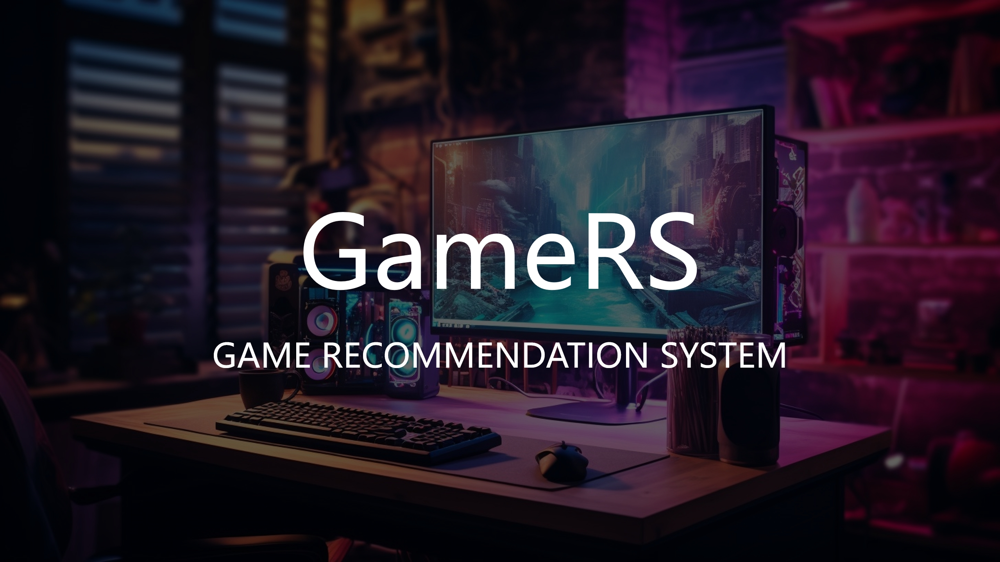

## SECTION 1 : PROJECT TITLE
## GameRS: Game Recommendation System

## SECTION 2 : EXECUTIVE SUMMARY / PAPER ABSTRACT
In today's digital era, the gaming industry has witnessed exponential growth, offering a vast array of games across numerous categories. To cater to the diverse preferences and ever-evolving trends, it has become crucial to develop a robust and efficient game recommendation system. Such a system aims to enhance the user experience by suggesting relevant games tailored to individual preferences. Our project’s aim is serving users better and keeping up with the dynamic nature of the gaming industry with a multifunctional and convenient game recommendation system.

To meet market demands, our system will focus on game matching, user profiling, chatbot interface, game introduction, and advanced recommendation algorithms. We will ensure quick and accurate game matching based on factors such as genre and gameplay style. Users will have personalized profiles where they can input their gaming preferences, playing habits, and favorite genres. Our chatbot interface will provide a convenient way for users to search, answer basic questions, and display relevant data. The system will also include an introduction page for each game to provide detailed information.

In conclusion, we successfully developed a multifunctional and convenient game recommendation system using IRS knowledge with python, html, javascript and flask. It has main functions like game/genre based recommendation, chatbot interface, data visualization, blur search, user account and so on. With our Personalization, Two-way and Conversational system, we expect a good market impact and bridge function.

## SECTION 3 : CREDITS / PROJECT CONTRIBUTION

| Official Full Name  | Student ID (MTech Applicable)  | Work Items (Who Did What) |
| :------------ |:---------------:| :-----| :-----|
| Chen Haoquan | A0286061E | Team leader and Project manager for project. Do the market researches, work distribution, prototype making, website design and developing, data visualization and blur search developing, testing and version control, report writing, videos making |
| Liang Jinning | A0285754N | xxxxxxxxxx yyyyyyyyyy zzzzzzzzzz|
| Cui Mengchen | A0285690R | xxxxxxxxxx yyyyyyyyyy zzzzzzzzzz|
| Huang Yifei  | A0285719M | xxxxxxxxxx yyyyyyyyyy zzzzzzzzzz|

---

## SECTION 4 : VIDEO OF SYSTEM MODELLING & USE CASE DEMO

under the folder video/

---

## SECTION 5 : USER GUIDE

`Refer to appendix <Installation & User Guide> in project report at Github Folder: ProjectReport`

### To run the system using python
### Step 1 install python
> install python
### Step 2 clone project
> download our project from github
### Step 3 install environments
> pip install -r requirements.txt 
### Step 4 get similarity metrix
> run IRS-PM-2023-10-19-GameRS/SystemCode/GameRS/data/recommender.py to get similarity.pkl

> (Optional)run IRS-PM-2023-10-19-GameRS/SystemCode/GameRS/data/CSC_Tag.ipynb to get cv.pkl, recommend_genre.pkl, vectors.pkl
### Step 5 run the project
>cd GameRS (please run under this folder)

>$ python App.py

> **Go to URL using web browser** http://127.0.0.1:5000

